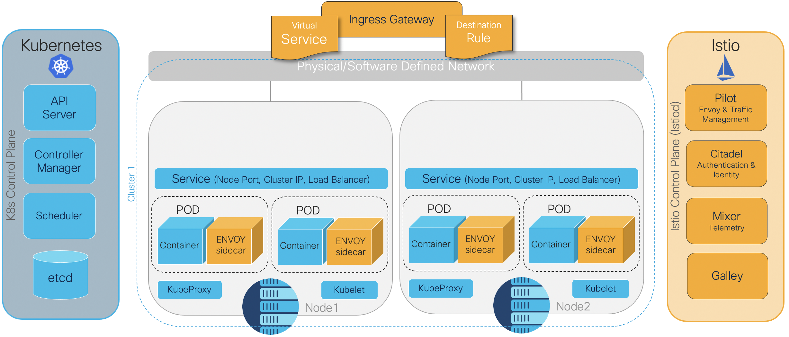
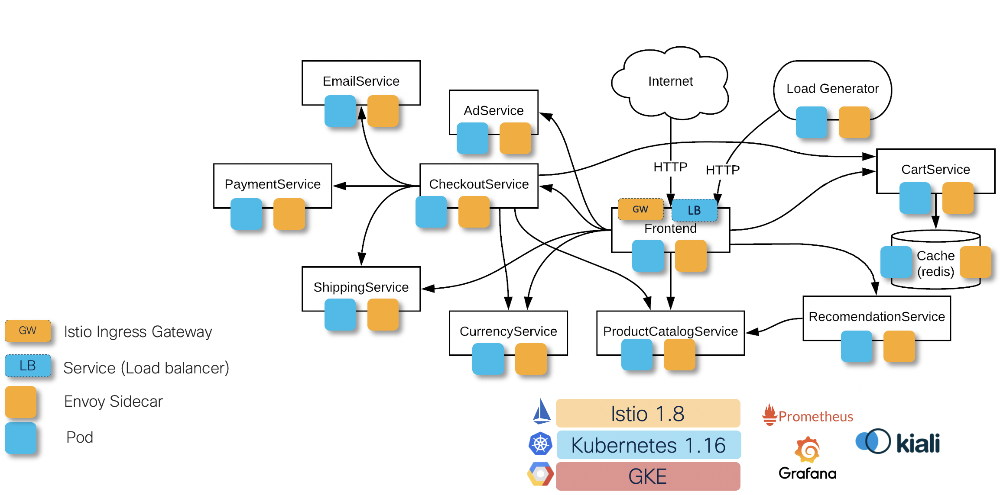
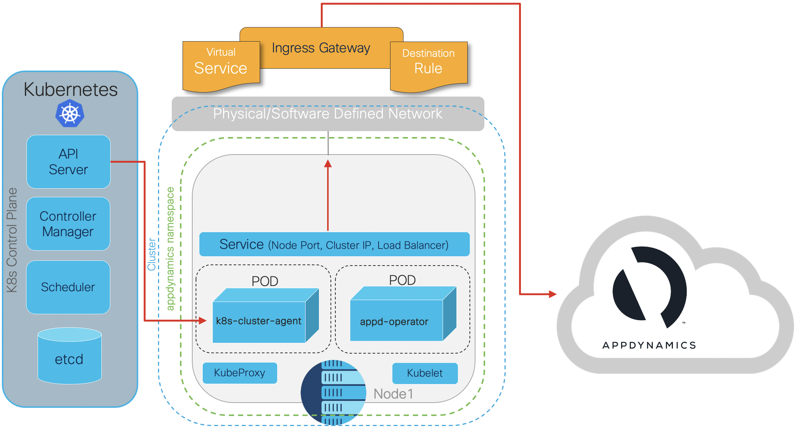
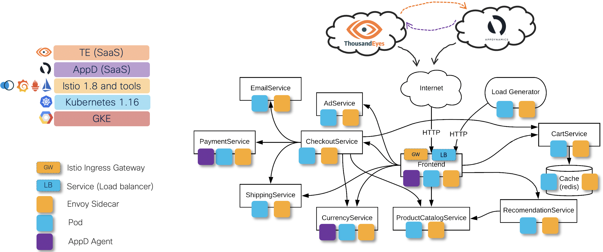
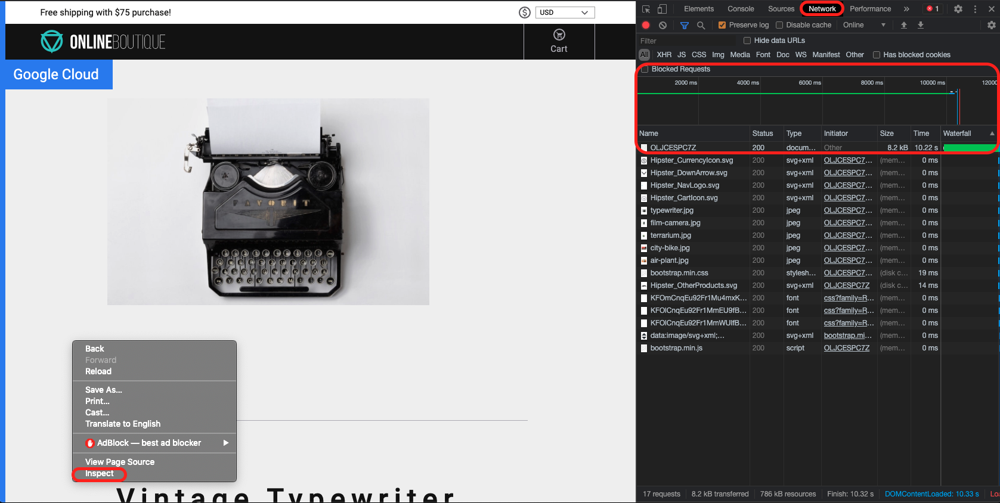
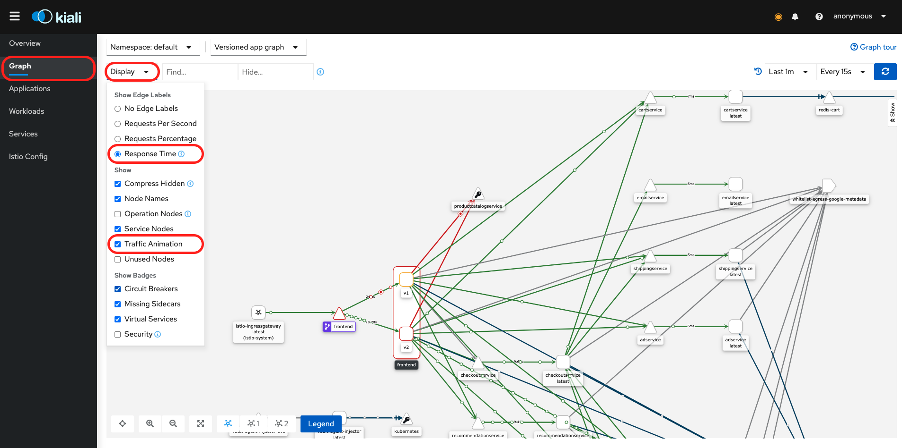
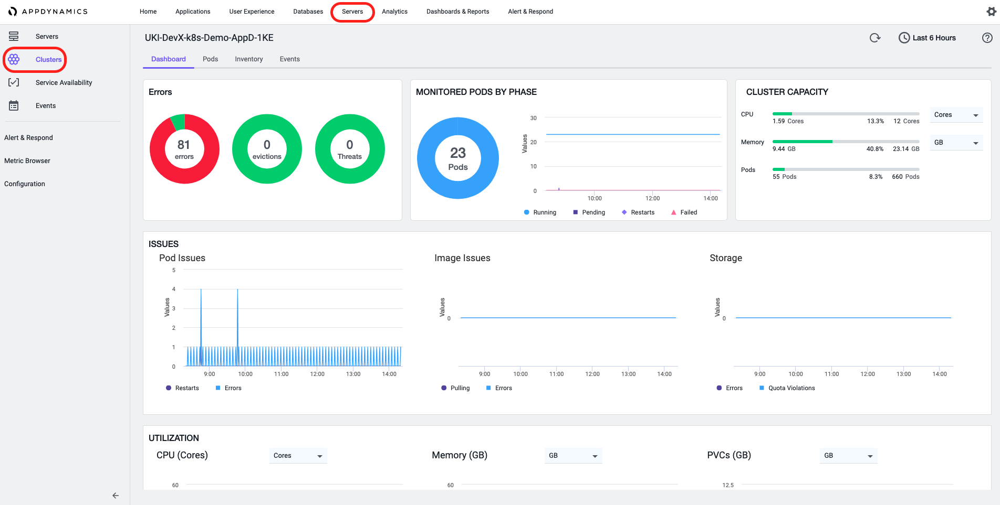

<p align="center">

</p>

**Online Boutique** is a cloud-native microservices demo application that consists of a 10-tier microservices application. The application is a web-based e-commerce app where users can browse items, add them to the cart, and purchase them.

**We use this application to demonstrate the use of Cloud Native technologies like Kubernetes/GKE, Istio, AppDynamics and ThousandEyes**. This application works on any Kubernetes (k8s) cluster, as well as Google Kubernetes Engine (GKE).

This project has is based on the [original open-source microservices-demo from Google](https://github.com/GoogleCloudPlatform/microservices-demo).

# Features

- **[Kubernetes](https://kubernetes.io)/[GKE](https://cloud.google.com/kubernetes-engine/):**
  The app is designed to run on Kubernetes.
- **[gRPC](https://grpc.io):** Microservices use a high volume of gRPC calls to
  communicate to each other.
- **[Istio](https://istio.io):** Application works on _Istio_ service mesh.
- **[Kiali](https://kiali.io/):** Web-based graphical UI to view service graphs of the mesh, traffic topologies and _Istio_ configuration objects.
- **[AppDynamics](https://www.appdynamics.com/) for _App_ and _Cluster_ visibility:** The _FrontEnd_ service is versioned and
  instrumented with AppDynamics for [application performance monitoring](https://www.appdynamics.com/product/application-performance-monitoring). The k8s cluster is instrumented with AppDynamics [Cluster Agent](https://www.appdynamics.com/solutions/kubernetes-monitoring) to monitor the health of of the entire cluster, including every node and namespace down to the container level. [**GET YOUR APPDYNAMICS FREE TRIAL HERE**](https://www.appdynamics.com/free-trial/).
- **[ThousandEyes](https://www.thousandeyes.com/) for external Network visibility and end-user experience:** _ThousandEyes_
  [Browser Synthetics](https://www.thousandeyes.com/product/browser-synthetics) simulate users interacting with the application. ThousandEyes Cloud Agents were deployed, across the globe, to simulate these interactions and provide metrics, such as _availability_, _response time_, _latency_, _transaction times_, _errors_. [**GET YOUR THOUSANDEYES FREE TRIAL HERE**](https://www.thousandeyes.com/signup/).
- **[ThousandEyes & AppDynamics Integration](https://www.appdynamics.com/product/network-monitoring) for complete application service visibility:**
  ThousandEyes alerts are natively configured to trigger alerts in AppDynamics to correlate external network and user experience problems with internal application metrics. 
- **[Cloud Operations (Stackdriver)](https://cloud.google.com/products/operations):** Many services
  are instrumented with **Profiling**, **Tracing** and **Debugging**. In
  addition to these, using Istio enables features like Request/Response
  **Metrics** and **Context Graph** out of the box. When it is running out of
  Google Cloud, this code path remains inactive.
- **Synthetic Load Generation:** The application demo comes with a background
  job that creates realistic usage patterns on the website using
  [Locust](https://locust.io/) load generator.


# Architecture

## Microservices
**Online Boutique** is composed of 11 microservices written in different languages that talk to each other over [_gRPC_](https://grpc.io/).

[](./docs/img/architecture-diagram.png)

| Service                                              | Language      | Description                                                                                                                       |
| ---------------------------------------------------- | ------------- | --------------------------------------------------------------------------------------------------------------------------------- |
| [frontend](./src/frontend-v1)                           | Go            | Exposes an HTTP server to serve the website. Does not require signup/login and generates session IDs for all users automatically. |
| [cartservice](./src/cartservice)                     | C#            | Stores the items in the user's shopping cart in Redis and retrieves it.                                                           |
| [productcatalogservice](./src/productcatalogservice) | Go            | Provides the list of products from a JSON file and ability to search products and get individual products.                        |
| [currencyservice](./src/currencyservice)             | Node.js       | Converts one money amount to another currency. Uses real values fetched from European Central Bank. It's the highest QPS service. |
| [paymentservice](./src/paymentservice)               | Node.js       | Charges the given credit card info (mock) with the given amount and returns a transaction ID.                                     |
| [shippingservice](./src/shippingservice)             | Go            | Gives shipping cost estimates based on the shopping cart. Ships items to the given address (mock)                                 |
| [emailservice](./src/emailservice)                   | Python        | Sends users an order confirmation email (mock).                                                                                   |
| [checkoutservice](./src/checkoutservice)             | Go            | Retrieves user cart, prepares order and orchestrates the payment, shipping and the email notification.                            |
| [recommendationservice](./src/recommendationservice) | Python        | Recommends other products based on what's given in the cart.                                                                      |
| [adservice](./src/adservice)                         | Java          | Provides text ads based on given context words.                                                                                   |
| [loadgenerator](./src/loadgenerator)                 | Python/Locust | Continuously sends requests imitating realistic user shopping flows to the frontend.

## Kubernetes and Istio

The _Online Boutique_ is initially deployed in GKE with _Istio_, which defines the _Service Mesh_ and handles service-to-service communication. _Istio_  allows to decouple traffic management from application code by attaching a sidecar proxy (called envoy) next to each container that intercepts all incoming and outgoing communications. The interaction between all these proxies in the data plane, together with a common control plane then creates the service mesh. This fundamentally helps you understand traffic flows among services and how to manage them with policies, protection and authentication. 

In this project, ingress resources like an _Istio_ `Gateway` and `VirtualService` are deployed to expose the _Online Boutique_ frontend running inside a Kubernetes cluster.

[](./docs/img/k8s-istio-diagram.png)

[](./docs/img/ServiceMesh-Architecture.png)

## AppDynamics Agents
With _Istio_ at full steam we then focus on getting visibility into how the cluster and the application are performing. We start by using _Kiali_ which comes natively integrated with _Istio_ and provides visibility at the network service layer. We then implement _AppDynamics Agents_, at the infrastructure (i.e. cluster) and application layer.

### Cluster-Agent
This agent is deployed in its own _namespace_ and collects metrics and metadata for the entire cluster, including every node and namespace down to the container level, via the Kubernetes API. It then sends this information to the AppDynamics Controller.

[](./docs/img/cluster-agent-arch.png)

The _AppDynamics cluster-agent_ also comes with an _auto-instrument_ feature, only available for _.NET_, _JAVA_ and _Node.js_. This dynamically and automatically adds the required application agents to the targeted applications. In essence, the _cluster agent_ modifies the application deployment by adding an _init_ container that installs the required AppDynamics application agent on the application container when it automatically restarts. Both the _paymentservice_ & _currencyservice_ are _Node.js_ applications so the _AppDynamics cluster-agent_ automatically instruments them, as covered in the _Deployment_ section. However, due to some AppDynamics gRPC limitations the information of these are microservices is not being correlated at the _AppDynamics Controller level_. The goal is to solve this issue by building a gRPC middleware that allows the AppDynamics controller to correlate the information between the microservices.

[](./docs/img/cluster-agent-auto-instrumentation.png)

### Application Performance Monitoring
At the moment, from an application perspective, only the _FrontEnd_ microservice is meaningfully instrumented with a AppDynamics APM agent as this is the most used microservice. _Extending the AppDynamics APM agents to the remaining microservices is currently work-in-progress_.

## ThousandEyes
With AppDynamics providing visibility at both the infrastructure and application layer, this is then augmented with _ThousandEyes Cloud Agents_ that provide **external visibility** from global vantage points (Cloud agents across 58 countries), the internet and browser synthetics. This provides an end-to-end view into the delivery of the _Online Boutique_ app to the user, whilst getting enhanced insights on the user experience.

The full architecture of the _Online Boutique_ application, with all the tools deployed looks as follows.

[](./docs/img/full-arch-te-appd.png)

# Deployment

## Prerequisites 
- [Docker for Desktop](https://www.docker.com/products/docker-desktop)
- A Google Cloud Project, [new]((https://cloud.google.com/resource-manager/docs/creating-managing-projects#creating_a_project)) or existing with _Google Container Registry_ enabled
- The Google [Cloud SDK](https://cloud.google.com/sdk/install) installed, that includes the `gcloud` command-line tool
- `kubectl`, which can be installed via `gcloud components install kubectl`
- GCP APIs for Cloud Monitoring, Tracing, Debugger enabled:
```sh
gcloud services enable monitoring.googleapis.com \
    cloudtrace.googleapis.com \
    clouddebugger.googleapis.com
```

## Quick-Start with GKE and Istio
1.  **Set the `PROJECT_ID` env variable and ensure the GKE API is enabled:**

    ```sh
    PROJECT_ID="<your-project-id>"
    gcloud services enable container --project ${PROJECT_ID}
    ```

    ```sh
    gcloud services enable container.googleapis.com
    gcloud services enable cloudprofiler.googleapis.com
    ```
   
2.  **Enable _Google Container Registry (GCR)_ on your GCP project:**

    ```sh
    gcloud services enable containerregistry.googleapis.com
    ```
    Configure the `docker` CLI to authenticate to GCR:
    ```sh
    gcloud auth configure-docker -q
    ```

3.  **Clone this repo:**
    ```sh
    git clone https://github.com/JPedro2/Cloud-Native-Demo.git
    cd Cloud-Native-Demo
    ```

4.  **Create the GKE cluster:** 
    ```sh
    ZONE=europe-west2-a
    gcloud container clusters create <your-cluster-name> \
        --project=${PROJECT_ID} --zone=${ZONE} \
        --enable-autoupgrade --enable-autoscaling \
        --min-nodes=6 --max-nodes=10 --machine-type=e2-standard-2
    ```
    Alternatively you can create a GKE cluster using the [Google Cloud UI](https://cloud.google.com/kubernetes-engine/docs/how-to/creating-a-zonal-cluster#creating-a-cluster). If you do, please make sure that you **DO NOT** select the `Enable Istio` option under _Features_, as we will be installing _Istio_ manually in step 6.

5.  **Point the `kubectl` context to the new GKE cluster:**
    ```sh
    gcloud container clusters get-credentials <cluster-name> --zone=${ZONE} --project=${PROJECT_ID}
    ```
    Alternatively you can get this command from the [GKE menu in the Cloud Console](https://console.cloud.google.com/kubernetes/) by clicking the _"Connect"_ button next to the k8s cluster that you just created.

    [](./docs/img/gke-connect-button.png)

    Use `kubectl` to confirm that you are pointing to that k8s cluster.
    ```sh
    kubectl config current-context
    ```

    ```sh
    kubectl get nodes
    ```

    Should output something like:
    ```sh
    NAME                                                  STATUS   ROLES    AGE   VERSION
    gke-boutique-appd-1key-boutique2-pool-8589b39d-9gm5   Ready    <none>   12m   v1.16.15-gke.6000
    gke-boutique-appd-1key-boutique2-pool-8589b39d-bm2y   Ready    <none>   12m   v1.16.15-gke.6000
    gke-boutique-appd-1key-boutique2-pool-8589b39d-cl2u   Ready    <none>   12m   v1.16.15-gke.6000
    gke-boutique-appd-1key-boutique2-pool-8589b39d-h3mr   Ready    <none>   12m   v1.16.15-gke.6000
    gke-boutique-appd-1key-boutique2-pool-8589b39d-i2ur   Ready    <none>   12m   v1.16.15-gke.6000
    gke-boutique-appd-1key-boutique2-pool-8589b39d-nbda   Ready    <none>   12m   v1.16.15-gke.6000
    ```


6.  **Install [Istio](https://istio.io/) and add `istioctl` to your path:**
    ```sh
    cd istio-1.8.0/
    istioctl install --set profile=demo -y
    export PATH=$PWD/bin:$PATH
    cd ..
    ```
    **Please Note:** This uses _Istio v1.8.0_. If you  wish to install another version, such as the latest one, you will need to follow [Istio's Getting Started guide](https://istio.io/latest/docs/setup/getting-started/).

7.  **Enable Istio sidecar proxy injection in the default k8s namespace**
    ```sh
    kubectl label namespace default istio-injection=enabled
    ```

8.  **Apply the k8s manifest that combines all of the microservices but the _Loadgenerator_**
    ```sh
    kubectl apply -f release/kubernetes-manifests.yaml
    ```

9.  **Apply the Istio manifest that combines all the initial Istio configuration rules - _gateway_, _ingress_ and _egress_**
    ```sh
    kubectl apply -f release/istio-manifests.yaml
    ```

10. **Get the Istio Ingress GW External IP Address:**
    ```sh
    kubectl -n istio-system get svc | grep "ingress"
    ```

11.  **Update the `loadgenerator.yaml.tplt` template k8s deployment with the _Istio Ingress GW IP Address_:**
     
     Go to the file `/kubernetes-manifests/loadgenerator.yaml.tplt` and update _line 37_ with the external IP address that you get from the previous step:
    
     ```YAML
     - name: FRONTEND_ADDR
       value: "<istio-ingressgateway-EXTERNAL-IP>:80"
     ```
     **After modifying the file and saving it make sure you rename it to `loadgenerator.yaml`.**

12.  **Apply the `loadgenerator.yaml` manifest:**
     ```sh
     kubectl apply -f kubernetes-manifests/loadgenerator.yaml
     ```

13. **Install Prometheus (optional), Grafana (optional) and Kiali as an Istio integration:**
     ```sh
     kubectl apply -f istio-1.8.0/samples/addons/prometheus.yaml
     kubectl apply -f istio-1.8.0/samples/addons/grafana.yaml
     kubectl apply -f istio-1.8.0/samples/addons/kiali.yaml
     ```

     **Please Note:** If you get a `no matches for kind "MonitoringDashboard"` error, just apply the `kiali.yaml` manifest again and the _monitoring dashboards_ should be created.

14. **Open the Kiali UI:** 
    ```sh
    istioctl dashboard kiali
    ```
    **This command ONLY works if you have `istioctl` in your `PATH`. If you restarted your terminal or are using a different terminal tab, you will need to do the following:**
    ```sh
    cd istio-1.8.0/
    export PATH=$PWD/bin:$PATH
    cd ..
    ```

    **OR alternatively**, you can also do it without `istioctl`, so that the session runs in the background:
    ```sh
    kubectl -n istio-system port-forward $(kubectl -n istio-system get pod -l app=kiali -o jsonpath='{.items[0].metadata.name}') 20001:20001 &
    ```
    Once this is running you will need to open a browser session with `http://localhost:20001`.

    [](./docs/img/kiali-dashboard-overview.png)
    
    **Please Note:** If you use use option above you then need to kill the `port-forward`, after you are done with the _Kiali_ dashboard:
    ```sh
    killall kubectl
    ```

## Service-Mesh with Istio
As _Istio_ allows you to decouple traffic management from application code, as well as helps you understand traffic flows between services. 
You can then, for example, define the percentage of traffic you want to send to a specific _canary_ version, or determine how to distribute traffic based on _source_/_destination_ or service version _weights_. This makes _A/B testing_, _gradual rollouts_, and _canary releases_ much easier to implement and manage.

Additionally, _Istio_ provides useful capabilities around [failure recovery to tolerate failing nodes or avoid cascading instabilities](https://istio.io/latest/docs/concepts/traffic-management/#working-with-your-applications), as well as [fault injection](https://istio.io/latest/docs/tasks/traffic-management/fault-injection/) (delays or connectivity failures) on specific requests to test application resiliency.

If you wish to experiment with some of these _Istio_ capabilities, you can `apply` some of the _istio_ manifests in the `/istio-manifests/routing` folder, and then with _Kiali_, visualise how the traffic flow changes. 

These _Istio_ manifests only focus on some specific traffic management use cases:
* Send traffic to different versions of a service based on source/destination, or service version weights. 
* Inject time delays at specific microservices
* Inject failures between microservices

As an example you may want to inject a 5 second delay on the _productcatalogservice_, to then evaluate how the other microservices behave and handle that scenario.

```sh
kubectl apply -f istio-manifests/routing/injection-delay.yaml 
```

Once this is deployed you can confirm it by going into your _Online Boutique_ external IP address in your browser and check that when you click in one of the products on the _FrontEnd_ landing page, it takes at least 5 seconds to load. If you are using _Chrome_ you can re-do these steps whilst using the _inspect_ tool (`right-click > inspect > Network`).

[](./docs/img/injection-delay-browser.png)

You can also visualise this using _Kiali_, as shown.

[](./docs/img/injection-delay-kiali.png)

Once you've evaluated and analysed the fault you will need to remove it so that your application goes back to normal.
```sh
kubectl delete -f istio-manifests/routing/injection-delay.yaml 
```

To deploy and explore the other _Istio_ manifests please check the [README in /istio-manifests](./istio-manifests).

**Please note** that the _FrontEnd-v2_ microservice is deployed in the AppDynamics section below.

## AppDynamics 

### Cluster Agent

The [AppDynamics Cluster Agent](https://docs.appdynamics.com/display/PRO45/Monitoring+Kubernetes+with+the+Cluster+Agent) used in this project is the `v20.10.0`. If you wish to use another version, or use a custom cluster agent image, you will need to build it and update the cluster agent manifest in `/AppD-Cluster-Agent-20.10/cluster-agent-operator.yaml`. For more info please check the [AppDynamics documentation on how to build the Cluster Agent Container Image](https://docs.appdynamics.com/display/PRO45/Build+the+Cluster+Agent+Container+Image).

To deploy the cluster agent we use the _AppDynamics Operator_, located in `/AppD-Cluster-Agent-20.10/cluster-agent-operator.yaml`.

1.  **Deploy _AppDynamics Operator_:**
    ```sh
    kubectl create namespace appdynamics
    kubectl create -f AppD-Cluster-Agent-20.10/cluster-agent-operator.yaml
    kubectl -n appdynamics get pods
    ```
    The output should be similar to the following:
    ```sh
    NAME                                    READY   STATUS    RESTARTS   AGE
    appdynamics-operator-6d95b46d86-67pmp   1/1     Running   0          2m
    ```

2.  **Create a Controller Access Key Secret:**
    ```sh
    kubectl -n appdynamics create secret generic cluster-agent-secret --from-literal=controller-key=<access-key>
    ```

3.  **Deploy the Cluster Agent:**
    Before running the _AppD cluster-agent_ manifest you need to first rename the `cluster-agent.yaml.tplt` file to `cluster-agent.yaml` and then update it with your _AppDynamics Controller_ details. Check here [for more information on how to configure the cluster-agent yaml file](https://docs.appdynamics.com/display/PRO45/Configure+the+Cluster+Agent).
    * `appName` in _line 8_ - Name of the cluster that displays in the AppDynamics Controller UI as your cluster name.
    * `controllerUrl` in _line 9_ - Full AppDynamics Controller URL.
    * `account` in _line 10_ - AppDynamics account name.
    * `defaultAppName` in _line 28_ - Application name used by the agent to report to the Controller.
    
    In this particular demo we are using the _AppD cluster-agent_ ability to [auto-instrument applications](https://docs.appdynamics.com/display/PRO21/Enable+Auto-Instrumentation+of+Supported+Applications). Since this feature only supports applications in _.NET_, _JAVA_ and _Node.js_, this only applies to the _paymentservice_ & _currencyservice_ microservices. This feature is implemented in your `cluster-agent.yaml` manifest from line 25 onwards. You can comment or delete those lines if you don't want the _auto-instrument_ feature turned on.

    ```sh
    kubectl create -f AppD-Cluster-Agent-20.10/cluster-agent.yaml
    kubectl -n appdynamics get pods
    ```
    The output should be similar to the following:
    ```sh
    NAME                                    READY   STATUS    RESTARTS   AGE
    appdynamics-operator-6d95b46d86-67pmp   1/1     Running   0          45m
    k8s-cluster-agent-79b6c95cb4-bdgzn      1/1     Running   0          1m30s
    ```

    **Please Note:** For debugging purposes, like if the controller doesn't receive data from the cluster agent, you can check the agent logs as follows:
    ```sh
    kubectl -n appdynamics logs <pod-name>
    ```

[](./docs/img/AppD-Dashboard-Cluster-Agent.png)

### APM Agent

The only microservice manually instrumented with _AppDynamics_ APM agent is the _FrontEnd_ microservice, written in `Golang`. _AppDynamics_ does not have an APM Agent per se for `GO`, instead we use the [AppDynamics GO SDK](https://docs.appdynamics.com/display/PRO45/Go+SDK), which in itself uses the `C++` SDK in the background. For more deep and detailed information on how the _AppDynamics_ `GO` SDK is implemented in-line with the _FrontEnd_ code, you can check the the [README in src/frontend-v2-appD](./src/frontend-v2-appD).

The goal is to deploy a _frontEnd_ version of the microservice that is instrumented with _AppDynamics_ `GO` agent and not replace the existing non-instrumented one. For that we will deploy another _FrontEnd_ `v2` microservice, which is then added to the _Istio_ service mesh that allows us to perform some interesting _traffic management_ routines, like send traffic to either `v1` or `v2` based on version weights.

1. **Add AppDynamics Controller Settings to _frontEnd_ `v2` manifest:**
   Start by renaming the `frontend-v2.yaml.tplt` file to `frontend-v2.yaml`, located in the `/kubernetes-manifests` folder.
   Add your AppDynamics controller details to the manifest, from _line 72_ to _line 81_.
   ```YAML
   - name: APPD_CONTROLLER_HOST
     value: "<appdynamics-controller-host>"
   - name: APPD_CONTROLLER_PORT
     value: "443"
   - name: APPD_CONTROLLER_USE_SSL
     value: "true"
   - name: APPD_CONTROLLER_ACCOUNT
     value: "<account-name>"
   - name: APPD_CONTROLLER_ACCESS_KEY
     value: "<access-key>"
   ```

2. **Deploy the AppD instrumented _frontEnd_ `v2` to the cluster:**
   ```sh
   kubectl apply -f kubernetes-manifests/frontend2.yaml
   ```
3. **Apply an _Istio_ destination rule that sets both _frontEnd_ microservices with `v1` and `v2` labels:**
   ```sh
   kubectl apply -f istio-manifests/routing/destination-rule.yaml
   ```
4. **Apply an _Istio_ policy rule that routes traffic to _frontEnd_ `v1` and `v2` based on pre-selected weight:**
   ```sh
   kubectl apply -f istio-manifests/routing/frontend-weighted-v1-v2.yaml
   ```
   **Please Note:** If you wish to experiment and change the weights, you can just modify the `weight` variables in _line 31_ and _37_ of the _Istio_ routing manifest `frontend-weighted-v1-v2.yaml` in `/istio-manifest/routing` and then re-apply the manifest. 
   Similarly to the section above, you can visualise how the traffic is flowing with this routing policy by looking at the _Kiali_ graph.

[](./docs/img/AppD-Dashboard-FrontEnd-APM.gif)
## ThousandEyes

### Cloud Agent - HTTP Server Tests
In this project, at the moment, ONLY the [_ThousandEyes Cloud Agents_](https://www.thousandeyes.com/product/cloud-agents) are used. These provide an _External Vantage Point_ as they are globally distributed agents installed and managed by ThousandEyes in 190+ cities in 58 countries and immediately available.

Below is an example of how you can quickly create an `HTTP Server` test against the _Online Boutique_ frontEnd. This test can be performed as often as every minute and from several locations around the world. It provides you with insights on _Availability_, _Response Time_, _Throughput_ and you can even do a _Path Visualization_ to workout which routes is your application given out of GCP **OR**, most importantly, check if there is an issue in the network path if the application performance starts degrading. 

[](./docs/img/TE-HTTP-Server-Test.gif)

### Cloud Agent - HTTP Transaction Tests
Something far more exotic than `HTTP Server` tests are the `HTTP Transaction` tests that provide application experience insights with _Web Synthetics_. These types of tests measure entire multi-page workflows, with credential handling, simulating a complete user journey making sure those journeys complete sucessfully while providing an insight into the user experience. This allows for multi-layer correlation as you can now have transaction scripting tests with further information around _HTTP_, _Path Viz_, _BGP_ and _Internet Outages_.

To _write_ and _test_ transaction scripts _ThousandEyes_ provides a `ThousandEyes Recorder` application, that records your user journey through the web application and builds the `Transaction Script` for you automatically - **no code expertise required**. All you have to then do is export that `Transaction Script` to your _ThousandEyes_ transaction test and run it, as before, as often as every minute and from several locations around the world.

**To fully utilise this feature I highly recommend that you watch [this short video tutorial](https://docs.thousandeyes.com/product-documentation/tests/getting-started-with-transactions)**. 

If you wish to test this out without building your own transaction test scripts, you can use the ones in the [ThousandEyes](./ThousandEyes) folder. To do so, **make sure** that you add and *save* the `<Online-Boutique-IP-Address>` in _line 10_ of both files before you export them to _ThousandEyes_. Below is an example of how you can quickly deploy these transaction test scripts.

[](./docs/img/TE-Web-Transaction-Test.gif)

## ThousandEyes and AppDynamics Integration Integration

### Native Alerts
_ThousandEyes_ natively supports sending alert notifications directly to _AppDynamics_. This allows you to correlate trigger events with clear events, and to create policies in _AppDynamics_ based on specific properties like: _alertState_, _alertType_ (HTTP, Network, Voice, etc) and _testName_. In _AppDynamics_, _ThousandEyes_ alerts show up as custom events of type _ThousandEyesAlert_ and allow you to open the _ThousandEyes_ app at the _Views_ screen for the alert start time to have further visibility into the issue.

[](./docs/img/TE-AppD-Integration-Alerts.gif)

You can easily set up the native alerts integration by performing the steps in the official [ThousandEyes Documentation](https://docs.thousandeyes.com/product-documentation/alerts/integrations/appdynamics-integration).

### Custom Monitor [Work In Progress]

_ThousandEyes_ data can be pushed to the _AppDynamics_ controller via a _ThousandEyes_ custom monitor, which is basically a [_AppDynamics_ machine agent extension](https://docs.appdynamics.com/display/PRO45/Extensions+and+Custom+Metrics). This example shows how to create a custom monitor that pulls test data from the [_ThousandEyes_ API](https://developer.thousandeyes.com/), transforms the data payload, and pushes that data to the _AppDynamics_ controller via custom metrics.

**Please Note:** The _ThousandEyes_ monitor machine agent does not need to run in the same environment as your application and you can only associate a machine agent (the _ThousandEyes_ monitor) with one application.

[](./docs/img/AppD-TE-CustomMonitor.png)

## Hashicorp Vault [Work In Progress]

In this project we use [Hashicorp Vault](https://www.hashicorp.com/products/vault) to manage and securely store the k8s secrets. For this we use a tool called [vault-k8s](https://github.com/hashicorp/vault-k8s), which leverages the Kubernetes Mutating Admission Webhook to intercept and augment specifically annotated pod configuration for secrets injection using the _Init_ and _Sidecar_ containers.

It is recommended that `vault-k8s` is installed via the [Vault Helm chart](https://github.com/hashicorp/vault-helm) as this will automatically configure the Vault and Kubernetes integration to run within an existing Kubernetes cluster. We will be using [Homebew (macOS)](https://brew.sh/) to install Helm. If you already have [Helm](https://helm.sh/) installed, please start from 2.

1.  **Install Helm with Brew**
    ```sh
    brew install helm
    ```

2.  **Initialize Hashicorp Helm Chart Repo**
    ```sh
    helm repo add hashicorp https://helm.releases.hashicorp.com
    ```

3.  **Install the latest version of Vault**
    ```sh
    helm install vault hashicorp/vault
    ```
